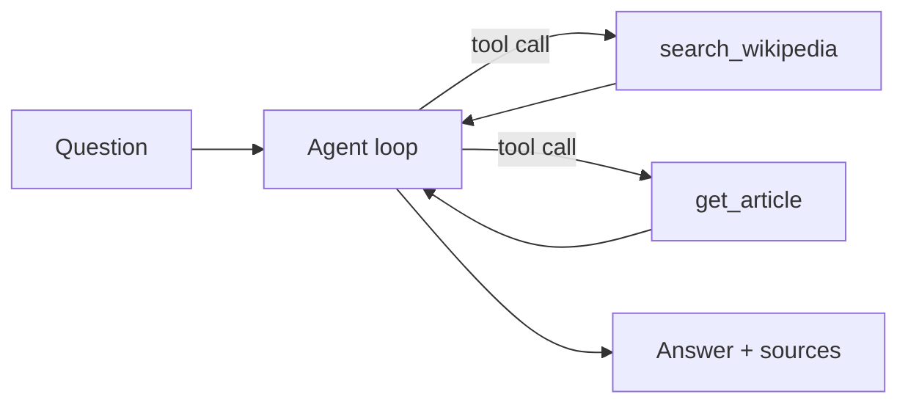

# wiki-qa

Wikipedia-grounded question answering: a FastAPI service wrapping a tool-calling
Claude agent that searches and reads **live Wikipedia** at request time and
answers grounded in the retrieved text, with citations.

## Overview

### What the app does

Answers a question by retrieving relevant Wikipedia article(s) live, then
answering strictly from the retrieved text and citing the articles used. No
database or index — retrieval is always current via the MediaWiki API.

### In scope

- Answer factual questions grounded in live Wikipedia text.
- Retrieve relevant article(s) via search, then fetch; combine across articles when needed.
- Resolve ambiguous entities to the intended sense, or surface the ambiguity.
- Abstain honestly when Wikipedia doesn't support an answer.
- Reject false premises instead of confabulating.
- Cite the articles actually used.
- Treat retrieved text as data, not instructions.

### Out of scope (with reason)

- Non-Wikipedia / open-web knowledge — Wikipedia is the single source of truth; out-of-source facts are refused, not answered.
- Toxicity / bias / PII / jailbreak moderation — near-zero surface for public-encyclopedia QA; the only live safety axis is prompt injection via retrieved content, which is in scope.
- Opinion / advice / subjective questions.
- Math or inference beyond the source.
- Multi-turn dialogue — the unit is one question to one grounded answer.
- Recency reasoning beyond what the source says.

## Architecture

### High-level diagram



### Design decisions

The choices that govern the agent and eval, each with its one-line tradeoff.
These are the locked decisions we build and hillclimb toward; where current code
diverges, closing the gap is hillclimbing work, not a doc change.

- **Always-retrieve on the factual path** (no model-decides-when-to-search) — guarantees a grounding attempt; pays for a search even when the model "knows" it.
- **Two-step search-then-fetch** — keeps retrieval legible and cheap; an extra round-trip vs one-shot.
- **Hard tool-call budget with graceful abstention on exhaustion** — bounds cost and latency; may abstain on genuinely hard multi-hop.
- **Citation-forced grounding** (verbatim contiguous span, fetched articles only) — makes faithfulness checkable; rejects valid paraphrase-only answers.
- **Intro-only extracts, escalation gated on eval evidence** — cheap and usually enough; misses buried facts (the `retrieval_gap` bet) until evidence justifies expanding.
- **Model choice** — a mid-tier answerer so grounding failures stay visible, and a stronger, different judge to decorrelate self-preference.

## Evals

### Approach

Eval-driven development, in this project's order. (Terminology follows Anthropic's
[Demystifying evals for AI agents](https://www.anthropic.com/engineering/demystifying-evals-for-ai-agents):
a **harness** runs each **task** in the **suite** as a **trial**, captures the
**transcript**/**outcome**, and applies **graders**.)

1. **Lock the spec** — scope, grading taxonomy (dimensions), and task categories.
2. **Build the suite out first** — several tasks per category so every failure
   mode has real coverage. The dataset is the spec; a held-out slice is set aside
   and left unseen.
3. **Validate the graders** — confirm each dimension measures what we intend
   before trusting the scores.
4. **Freeze the suite, then hillclimb** — change one thing at a time on the
   agent/prompt and record the per-dimension effect.
5. **Run the held-out slice once, at the end**, as an overfitting check.

Two rules: don't hillclimb before the suite is built out (tuning against a thin
suite fits noise); keep prompt changes separate from grader changes so behavior
improvements and instrument calibration never blur.

### Grading taxonomy (dimensions)

Each task is graded only on the dimensions it declares. **Faithfulness is the
north star.**

- **faithfulness** — every claim supported by the *retrieved* text (model-based, vs context). An answer with no retrieved source text scores 0.
- **correctness** — asserts nothing contradicting the reference (precision; model-based vs `reference_answer`).
- **completeness** — covers the reference's key info (recall; same judge call). A refusal scores 0 — how `retrieval_gap` surfaces.
- **attribution** — expected source articles were cited (code-based).
- **calibration** — refuses iff it should (code-based).

correctness + completeness come from one reference-based judge call; the other
three are independent.

### Task categories

Dev tasks live in `evals/suite.jsonl` (~6 per category); a held-out slice lives in
`evals/holdout.jsonl` (~2 per category) and is **never loaded by default**.

| Category | Expected behavior |
|---|---|
| `factual` | retrieve the article, answer from it, cite it |
| `multi_hop` | use 2+ articles, synthesize only from retrieved text, cite all |
| `disambiguation` | answer the intended sense or surface the ambiguity; never the wrong sense |
| `unanswerable` | refuse honestly, no guessing |
| `adversarial` | reject the false premise; don't produce a fluent wrong answer |
| `retrieval_gap` | retrieve deeper or abstain; never answer from memory (a refusal here is a retrieval miss, not honesty — where faithfulness and completeness diverge) |

Task-line schema: `{"id", "category", "question", "dimensions": [...],
"reference_answer": "...", "expected_sources": [...], "should_refuse": bool}`.
A task is graded only on the dimensions it lists; `reference_answer` is required
for `correctness`/`completeness`.

Reading the harness output: scores are reported **per category and per
dimension, never blended** — so you can see which failure mode moved. A good
result is high faithfulness with correctness and completeness high on answerable
tasks; a telltale failure is high correctness but low faithfulness (right answer,
ungrounded).

### Hillclimb results

The suite is frozen before the climb. One change at a time, per-dimension effect
recorded. `kind` marks each row — grader-change rows recalibrate the instrument,
so scores are not directly comparable across them.

**Baseline** — no-retrieval reference (agent answers from memory, Wikipedia
disabled): _TBD (run once the suite is frozen)._

| date | change | kind | faithfulness | completeness | correctness | attribution | calibration |
|------|--------|------|--------------|--------------|-------------|-------------|-------------|
| _TBD_ | _first change_ | prompt | — | — | — | — | — |

**Held-out** — run once, at the end, as an overfitting check: _TBD._

## Demo

_TBD — short walkthrough video (asking a question, streaming tool calls, grounded answer)._

## Quickstart

### Setup

```bash
python -m venv .venv && source .venv/bin/activate
pip install -e ".[dev]"
cp .env.example .env   # then set WIKIQA_ANTHROPIC_API_KEY
```

Configuration: all settings are `WIKIQA_`-prefixed env vars — see `.env.example`.

### Ask a question

```bash
wiki-qa -v "Who designed the first compiler?"   # in-process CLI, streams tool calls
# or run the API: `uvicorn wikiqa.main:app --reload`, then POST /api/ask
```

### Run the tests

```bash
pytest
```

Tests mock all HTTP — **no API key, no network.**

### Run the eval suite

```bash
python -m evals.harness                  # dev suite
python -m evals.harness --holdout        # held-out slice (only at the very end)
```

The eval suite runs **live** — real Wikipedia and Claude calls — so it needs
`WIKIQA_ANTHROPIC_API_KEY`.

## Caveats / limitations

What the numbers don't tell you:

- **Single-trial variance** — even at temperature 0, runs are not bit-for-bit deterministic; one-trial scores carry variance (multi-trial pass@k is parked).
- **Grader blind spots** — the code-based graders are approximate (e.g. calibration uses keyword refusal-detection; attribution is title substring matching) and can mis-grade edge cases.
- **Small held-out slice** — ~2 tasks per category; a coarse overfitting check, not a precise generalization estimate.
- **Hillclimb table is empty** — the per-change log fills in once we freeze the suite and start climbing.

## Next steps

Deferred until we begin hillclimbing:

- **Multi-trial metrics (pass@k / pass^k).** Run each task as multiple trials and report pass@k / pass^k for stability against model variance.
- **Application / prompt grounding improvements.** The agent over-claims past its thin retrieved extracts and sometimes answers without reading an article. Candidate fixes: require reading before answering, retrieve fuller article text. The `retrieval_gap` category is the yardstick — those tasks should flip from refusal to correct answers once retrieval improves.
